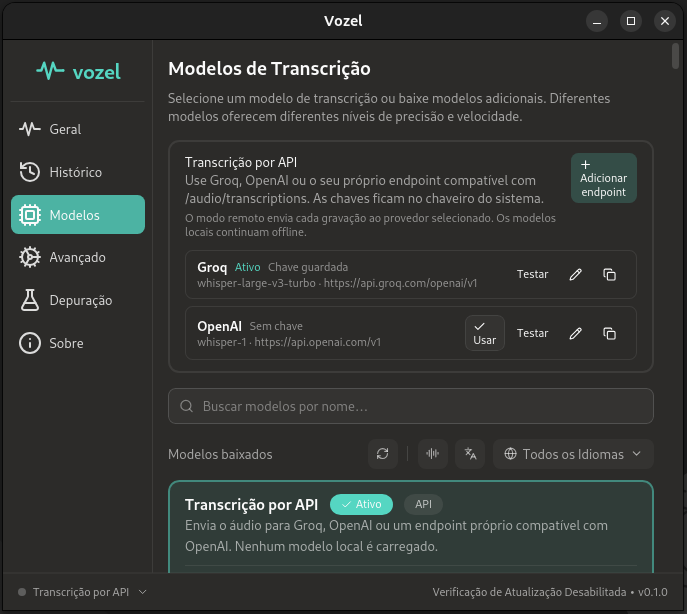

# Vozel

Vozel is an independently maintained desktop dictation app for Linux, macOS and
Windows. Press a shortcut, speak, and paste the transcription into the active
application. It supports local speech models and optional Groq, OpenAI or
OpenAI-compatible transcription APIs.



This project is a fork of [Handy by CJ Pais](https://github.com/cjpais/Handy).
Vozel has its own name, icon, application identifier and support channel. It is
not affiliated with, endorsed by or supported by the Handy project. The source
code retains the upstream MIT copyright notice in [LICENSE](LICENSE).

The [previous API Edition release](https://github.com/RenatoXimenes/Vozel/releases/tag/v0.9.7-api.1)
is a historical build under the old brand; it is **not** a Vozel installer. A
Vozel release will be linked here after its package has been built and checked.

## Local Nemotron 3.5 PT-BR

The model picker includes **Nemotron 3.5 ASR PT-BR**, a Brazilian Portuguese
fine-tune by Ottema AI converted to Q8_0 GGUF. Choose it and click **Download**;
Vozel saves and selects it automatically. No manual model folder is needed.
The download is about 751 MB. The model is not bundled with the app and does
not send recorded audio to a provider. This is distinct from the multilingual
Nemotron 3.5 base model.

The file is available in the [model release](https://github.com/RenatoXimenes/Vozel/releases/tag/vozel-models-v1). See the
[model origin, verification and limitations](docs/models/NEMOTRON_PTBR.md).
The model's [OpenMDW-1.1 license](licenses/OpenMDW-1.1.txt) is separate from
the application's MIT license. No accuracy benchmark for the converted GGUF
is claimed here.

## API transcription

1. Open **Settings → Models → API transcription**.
2. Edit the Groq or OpenAI preset, or add a compatible custom endpoint.
3. Enter the API key, save, test the connection and choose **Use**.
4. Select **API Transcription** in the model list.

API mode sends each recording to the selected provider. Its privacy, retention
and billing policies apply. Keys are stored in the operating system credential
store, outside the settings JSON. Custom remote endpoints require HTTPS;
redirects with credentials are disabled. [Details](docs/API_TRANSCRIPTION.md).

## Build from source

Install Rust stable, Bun and the platform prerequisites in [BUILD.md](BUILD.md).
Then run:

```bash
bun install
bun run tauri dev
```

To make a local package, run `bun run tauri build`. The package is named
**Vozel** with its own application identifier. Automatic updates are disabled
until this fork has a signed update feed.

## Existing Handy data

On first launch, Vozel copies settings, locally stored models, recordings and
history from the previous Handy application data directory when present. It
does not overwrite Vozel files or delete the original. If the system credential
store is available, saved API keys for imported endpoints are copied to
Vozel's own service. Portable installs continue using their existing `Data/`
directory and accept both old and new portable markers. Keep your old
installation and data until you confirm the import in Vozel.

## Help and contribution

Report Vozel bugs and security issues through this repository's
[issues](https://github.com/RenatoXimenes/Vozel/issues) and
[security policy](SECURITY.md). Upstream Handy has its own issue tracker;
please send Vozel-specific issues here. Read [CONTRIBUTING.md](CONTRIBUTING.md)
before proposing changes.

Vozel includes a separately installed [X11 smart paste helper](extras/smart-paste-x11/README.md).
The [fork changes](docs/FORK_CHANGES.md) document the main differences from
upstream. Historical upstream code and third-party dependency names remain
credited in source and build files where they identify their actual origin.
